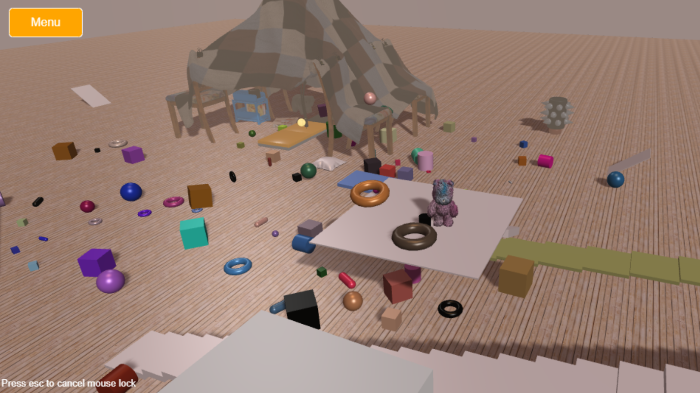
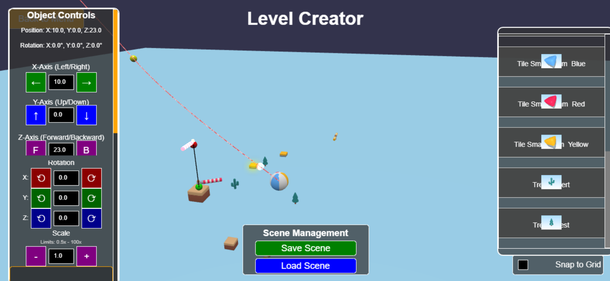

<!-- 
## Avancées depuis le dernier rendu

### Player Physics Character Controller retravaillé 
Pour le projet, j'ai passé beaucoup de temps à retravailler mon Player Character Controller [Player Character Controller](src/player/thirdPersonController.ts) en effet les implémentations faites précédement ne fonctionnaient pas lorsque j'ai voulu commencer à intéragir avec des objets ayant une physique dynamique et une masse > 1; Un des changements majeurs a été de passer d'un changement de velocity appliqué directement sur le character (lors des sauts, etc.) à l'utilisation des impulses. Mettre en place un character controller fontionnel n'a pas été simple, j'ai du faire pas mal de tests / debugs, recherches et reprise à partir de différents exemples trouvés dans la doc et forum (rappelons ici que mon character controller avait d'abbord était construit/inspiré à partir de celui de [ergoudan](https://github.com/armomu/ergoudan)).

### Création d'un petit menu
J'ai ensuite souhaité ajouter un petit menu de démarrage [Main Menu](src/MainMenu.ts) pour ne pas commencer directement sur la scène de jeu. C'est un ajout assez simple mais qui a necessité pas mal de restructuration de mon code.

### Correction et amélioration 
- des ombres et lumières
- des collisions de la caméra (ne pas voir à traver le sol et objets, etc.)

### Déploiement et CI
Mise en place d'un déploiement continu pour faciliter l'hebergement de mon projet. J'ai donc dockerizé mon projet et créé des github actions pour déployer automatiquement à chaque push sur la branche master. Le jeu est maintenant hébergé sur mon VPS ici: [https://fuzzleton.tristan-patout.fr/](https://fuzzleton.tristan-patout.fr/) 

### Création de niveaux
La création de niveaux a été l’un des aspects les plus complexes du projet. Au début, j'ai commencé par créer des objets 3D directement dans le code à l'aide de `MeshBuilder` (voir dans [objects](src/objects/)). 

J’ai ensuite voulu intégrer des assets 3D au format `.glb`/`.gltf`. Pour cela, j’ai mis en place un **gestionnaire d’assets** chargé de précharger ces fichiers avant le lancement de la scène ([basicAssetManager.ts](src/basicAssetManager.ts)).
Une fois le character controller fonctionnanr, je me suis posé la question de la création de niveaux de manière plus rapide, avec l’idée de concevoir un outil permettant de prototyper directement à partir d’assets 3D.  
Après plusieurs tentatives peu concluantes (notamment des essais de création dans Blender ou encore avec l’outil GridMap de Godot), je me suis résolu à concevoir un **éditeur de niveau intégré au jeu** (peu être pas la meilleure idée que j'ai eu ça sera très chronophage...).

Cet éditeur permet de **placer des objets `.glb` dans la scène via un système de drag and drop** ([levelCreator/](src/levelCreator/)). Il est ensuite possible de sauvegarder la scène dans un fichier `.json` afin de la recharger à partir de ce fichier.
Honnêtement, cette solution n’était sans doute pas la plus judicieuse : le code est long, désorganisé, et je l'avoue fortement généré avec Copilot (et Claude 3.7) (j'ai cependant était impressioné par la capacité de developpement à partir de mes instructions et pistes trouvées sur le forum Babylon et d'autres exemples de la doc - je n'aurais jamais pu réaliser un tel créateur de niveaux sans cela). De nombreuses parties restent quand même à améliorer, notamment la structure des classes, la gestion de l’UI (actuellement tout est fait dans via Babylon AdvancedDynamicTexture et autre serait peut être mieux et plus concis de faire directement en html css), et la réduction de la redondance dans le code.

Malgré ces défauts, j’ai réussi à obtenir un résultat fonctionnel, même si très perfectible. Cela m’a tout de même demandé beaucoup de temps de développement, débogage et tests de façon empirique. Mais ça a aussi été une occasion d’aprentissage sur BabylonJs. 

Un autre défi a été la **reconstruction des scènes à partir des fichiers `.json`**. Appliquer correctement la physique aux objets `.glb/.gltf` (issus du kit kaykit) (y compris à leurs enfants) tout en conservant leur structure afin qu'ils "restent" attachés entre eux et se comportent comme un seule objet a nécessité de nombreuses expérimentations et recherches.  
Après beaucoup d’essais, j’ai finalement pu mettre en place un système de chargement fonctionnel ([levelFromFile.ts](src/level/levelFromFile.ts)).

### Et maintenant ?
Après de nombreux tests, expérimentations, et résolutions de bugs, j’ai atteint un point où j’ai réussi à poser les fondations nécessaires à la création de niveaux.
Même si je suis un peu déçu de ne pas avoir pu aboutir à un jeu complet avec des niveaux, je suis tout de même satisfait d’avoir pu assembler les briques essentielles : moteur physique havok, ccharacter controller, gestion des assets, petite interface, éditeur de niveaux enregistrables et rechargables, etc.

Mes ambitions étaient sans doute un peu élevées pour un projet mené seul, mais cela m’a permis d’apprendre énormément sur divers aspects de Babylon.js comme les contraintes liées à l'utilisation d'un moteur physique, la gestion des assets 3D,  les shadows, collisions, animations, etc.

Je suis conscient que le code manque de clarté est n'est pas dutout propre, et que certains fichiers sont longs et peu structurés. Je compte continuer à le faire évoluer d’ici la soumission finale du concours et espère avoir un petit gameplay d'ici là.

Je tiens également à vous remercier pour l’opportunité que vous nous avez offerte à travers cette matière. Malgré les difficultés rencontrées, j’ai pris beaucoup de plaisir à découvrir Babylonjs et à me confronter à la création d’un jeu 3D.
J'espère que vous apprécierez le travail que j'ai pu faire (malgré des résultats en demi-teinte) et qu'il saura vous montrer ma motivation et mon investissement. 
Je suis bien entendu disponible pour discuter plus en détail des implémentation réalisées si besoin.

Tristan Patout. 

 -->
